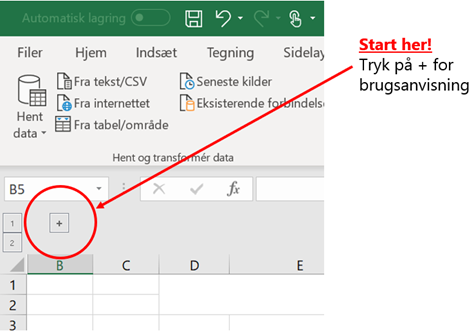

# Calcument Stat Arket
_Arket_ er et omfattende noteark og statistikværktøj udviklet af Sebastian Beck og Frederik Bredgaard. Det er designet til at hjælpe dig igennem statistik I og II på psykologi KU, men er blevet brugt på mange uddannelser og i mange kontekster.

_Arket_ regner alle de tests for dig, som Excel kan udføre. Alt det som Excel ikke magter guider _Arket_ dig igennem i SPSS med (hvad jeg håber er) klare markeringer og eksempler på APA-konklusioner, som du kan kopiere og redigere, så de passer til den pågældende undersøgelse.

## Download
Hvis du ikke er vant til at bruge git kan du hente _Arket_ ved at trykke på filnavnet ovenfor. Derefter kan du trykke på download-ikonet ude til højre. 

## Sådan bruger du arket
1. Brug forsiden til at finde den rigtige test
    - At finde den rigtige test er den vigtigste opgave i statistik - og det er her du skal huske en lille smule teori
    - Vi har gjort det let ved at inkludere et skema per fag (stat I/II) og et samlet skema
    - Følg skemaet fra venstre mod højre og vælg den rigtige test til dit formål og data
2. Klik dig ind på den rigtige test
3. Åbn instruktionsfanen ved at klikke på det lille `+` øverst til venstre
4. Følg instruktionerne
5. ???
6. Bestået.

Glem ikke at hver eneste side (inklusiv forsiden) har en instruktionsfane, der kan hjælpe dig: 
